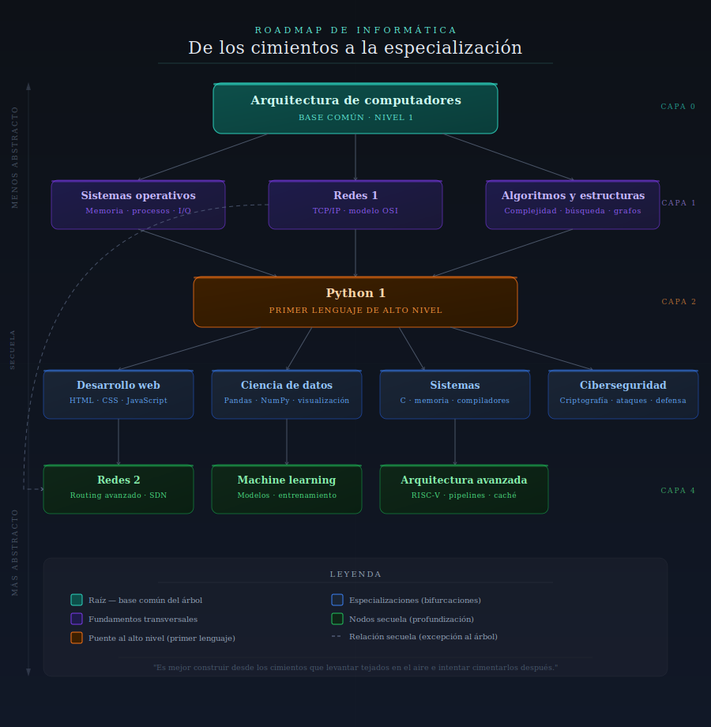

# CS Roadmap

Guía de referencia para personas que quieren aprender informática desde los cimientos. La premisa central:

> En informática, la abstracción es el proceso de eliminar la gestión manual de ciertos procesos para simplificar una tarea. Este roadmap parte de la idea de que **es mucho más fácil subir capas de abstracción que bajarlas**. Aunque dominar conceptos de bajo nivel supone un reto mayor al principio, cuanto más se profundiza en informática más aumenta el valor de ese conocimiento. Entender bien los cimientos hace que todo lo que viene encima sea más fácil de aprender y razonar.

## Estructura del grafo

El roadmap es un árbol invertido: la raíz es lo más fundamental y menos abstracto (arquitectura de ordenadores), y las ramas se bifurcan hacia especializaciones progresivamente más abstractas.

**Especialidades previstas:**
- Programación general → Web Dev, Game Dev, Software Architecture
- Datos e IA → Data Science, Machine Learning / IA
- Sistemas → Ciberseguridad, Redes / Infraestructura
- Bajo nivel → Hardware, Embedded / FPGA

Las ramas comparten un tronco común antes de bifurcarse. Cuanto antes se produce la bifurcación, más específica es la especialidad.

> **Nota sobre la dificultad:** un nodo puede ser poco abstracto pero de nivel avanzado, y situarse por tanto más abajo en el árbol que un nodo más abstracto pero básico. Ejemplo: `Arquitectura 1 → Python básico → Arquitectura avanzada`.

## Estado actual

En construcción. Se está elaborando el esquema de referencia (el grafo en `roadmap.canvas`) que servirá de base para construir la web definitiva.

## Cómo contribuir

### Requisitos
- [Obsidian](https://obsidian.md/) para visualizar y editar el canvas *(se aceptan propuestas de alternativas)*
- Git

### Pasos

1. Haz fork del repositorio y clónalo.
2. Abre la carpeta del repo como vault en Obsidian.
3. Si añades un nuevo nodo:
   - Crea el archivo `.md` en `/categorias/` siguiendo el [formato de nodo](#formato-de-nodo).
   - Añade el nodo al canvas (`roadmap.canvas`) como referencia al archivo, no como texto suelto.
   - Conéctalo con una arista al nodo padre correspondiente.
4. Abre una Pull Request describiendo la posición del nodo en el grafo y por qué encaja en ese punto.

> ⚠️ **Rutas en el canvas:** las referencias de archivo usan rutas relativas al vault de Obsidian, no al repositorio. Si tu vault tiene una estructura diferente, ajusta el prefijo de ruta en el JSON del canvas.

### Formato de nodo

```markdown
# Título del nodo #Tag
Justificación breve: por qué este nodo va aquí, qué aporta al que llega desde el nodo padre.

[Recurso 1](url) #YouTube
Descripción breve del recurso
[Recurso 2](url) #Paper
Descripción breve del recurso
[Recurso 3](url) #Libro
Descripción breve del recurso
```

Tags de recurso disponibles: `#YouTube`, `#Paper`, `#Libro`, `#Curso`, `#Herramienta`, `#Artículo`.

Tags de nodo: mínimo 1 tag de especialidad (path final del nodo). Tags adicionales para skills concretos cubiertos.

| Categoría | Tags |
|-----------|------|
| **Especialidad (path)** | `#programacion` `#web-dev` `#game-dev` `#data-science` `#machine-learning` `#ia` `#ciberseguridad` `#redes` `#hardware` `#embedded` `#software-architecture` `#devops` `#ux-dev` `#sistemas-operativos` |
| **Lenguaje** | `#c` `#cpp` `#c-sharp` `#python` `#javascript` `#typescript` `#golang` `#rust` `#java` `#bash` `#sql` |
| **Concepto** | `#low-level` `#concurrencia` `#punteros` `#memoria` `#algoritmos` `#estructuras-de-datos` `#patrones-de-diseno` `#compiladores` `#estadistica` `#criptografia` `#rest-api` |
| **Tecnología** | `#html` `#css` `#nodejs` `#react` `#vue` `#numpy` `#pandas` `#deep-learning` `#redes-neuronales` `#tcp-ip` `#protocolos` `#http` `#hacking` `#pentesting` `#fpga` `#arduino` `#electronica` |

Ejemplo: `# Golang 1 #programacion #golang #concurrencia`

### Criterios de calidad para recursos

- Gratuitos o con acceso público siempre que sea posible.
- Fuentes verificables: canales o autores reconocidos, publicaciones académicas, documentación oficial.
- En castellano si existe alternativa equivalente en calidad; si no, en inglés.
- No se aceptan recursos de pago sin alternativa gratuita equivalente.

## Normas de aportación

1. Alineación con la premisa: árbol invertido, menos abstracto arriba → más abstracto abajo.
2. La información debe ser fiable y verificable.
3. Todo nodo en `/categorias/` debe estar referenciado y conectado en `roadmap.canvas`.
4. Los nodos del canvas deben ser referencias a archivos, nunca "post-its" de texto suelto.


